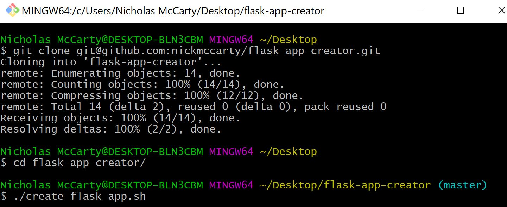
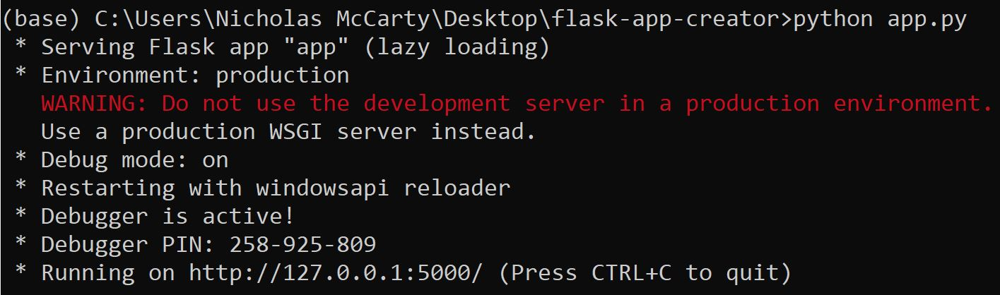

# Automated Creation of Flask App Scaffolding Using Self-Destructing Shell Scripts

> It's as easy as:

> 1) Cloning the repo,
> 2) Making "flask_app_creator" your current directory, and
> 3) Running the "create_flask_app" shell script (see below)

---

---

Now, you have freshly-constructed Flask app, which can be viewed in the browser by running your "app.py" file (see below)!

