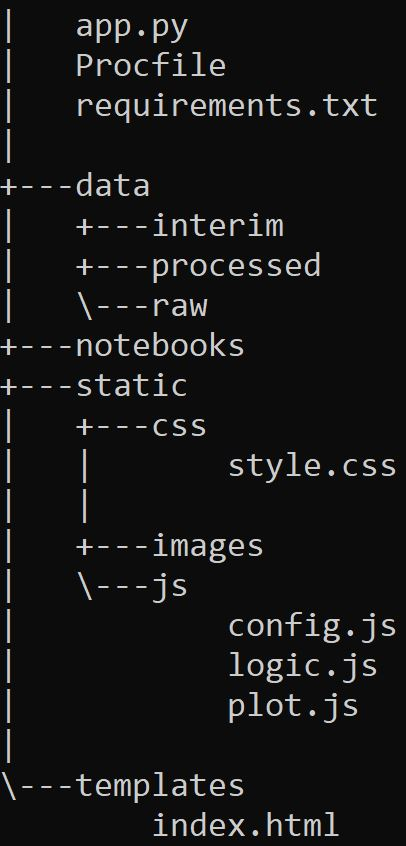
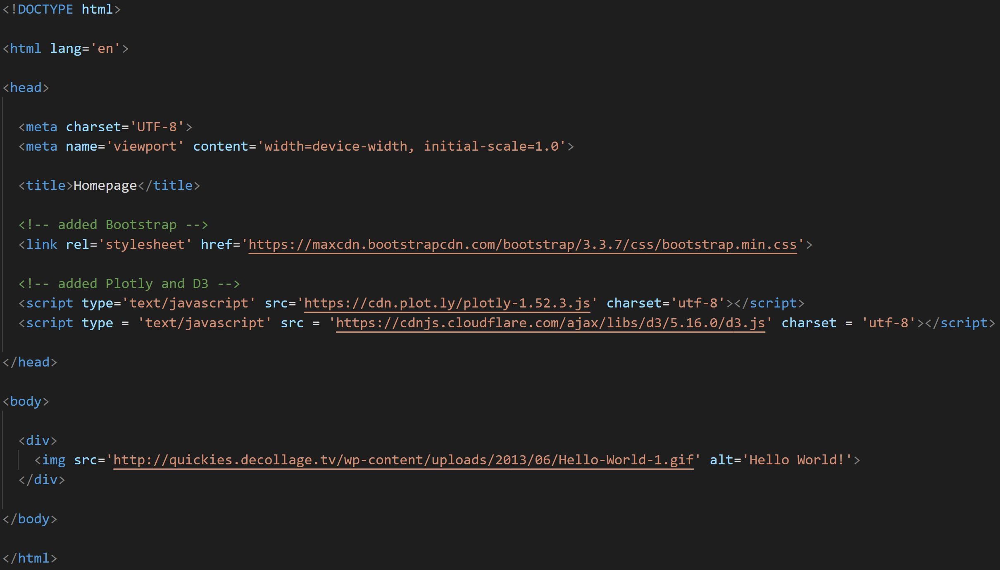

# Automated Creation of Flask App Scaffolding Using Self-Destructing Shell Scripts

> It's as easy as:

> - [x] Cloning or downloading the repo,
> - [x] Making ```flask_app_creator``` your current directory, and
> - [x] Running the ```create_flask_app``` shell script

---


---

Now, you have freshly-constructed Flask app, which can be viewed in the browser by running your ```app.py``` file!


---

And your file structure now looks like this:



**Note that a ```Procfile``` and ```requirements.txt``` file were included, in case you intend to deploy your app using Heroku. Additionally, a ```data``` folder was included to help organize various stages of data processing, and a ```notebook``` folder was included to serve an equivalent purpose with respect to notebooks.**

---

**Bonus:** your ```index.html``` file was created with the Bootstrap, Plotly, and D3 CDN links written into it:


